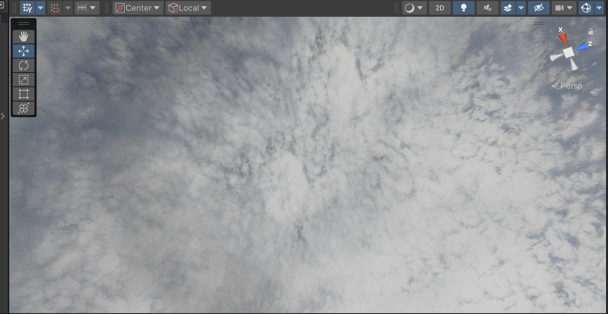
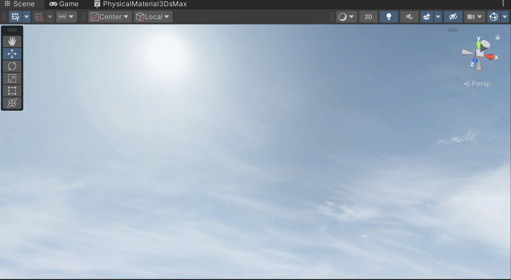

# Entry 3
##### 2/17/24

### Map creation and Skyboxes

The map is an essential part of our game because it allows the character to walk around and explore the environment. While my partner Safe works on the movement and animation for the character, my main focus was the background and map. I started considering what map we want to even start with and concluded that as long as I have a map for the character in general it should be fine and a desired map would be beyond the MVP so I started making a city.Through the [assets store](https://assetstore.unity.com/popular-assets/cities?clickref=1101lyifNRmj&utm_source=partnerize&utm_medium=affiliate&utm_campaign=unity_affiliate#free-cities-fZwT) I imported a custom city package through Unity's assets store and began downloading and importing the assets into my personal folder. With these assets, I began to change them and modify them enough so I can have a starter setting which can be shown on the picture below this:

Besides the map which to me already looks amazing, I have also decided to give it a skybox to give it that real life setting instead of just some bland city that has no life to it. I downloaded some custom skyboxes and decides to run through some of them.

## Skybox 1

## Skybox 2

[Previous](entry02.md) | [Next](entry04.md)

[Home](../README.md)